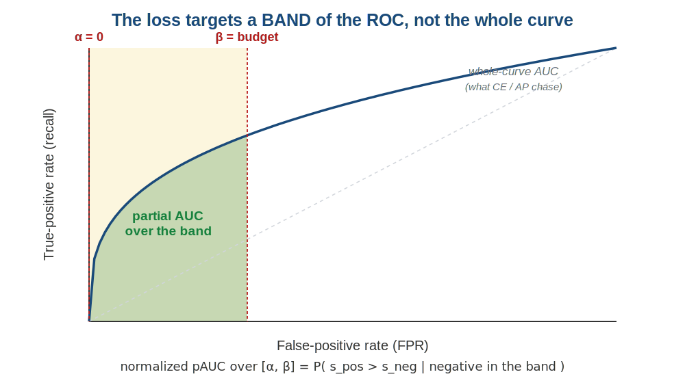
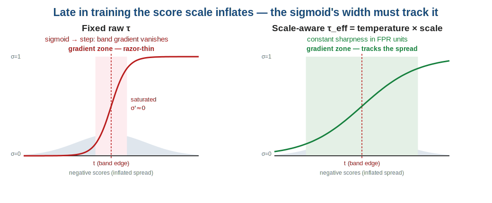
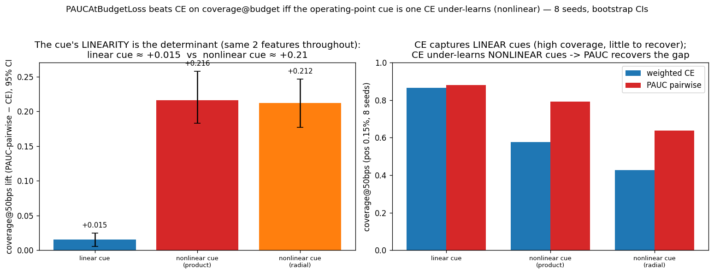
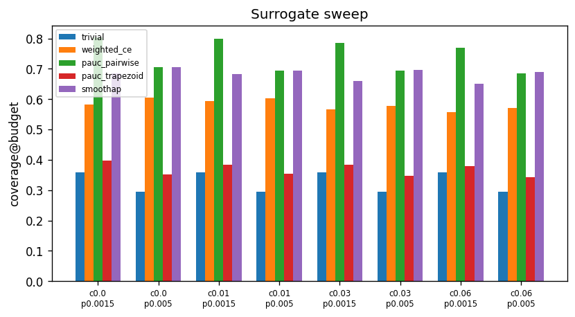
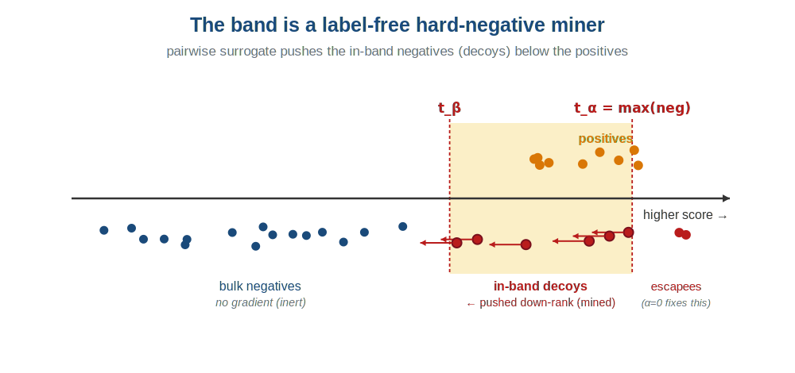
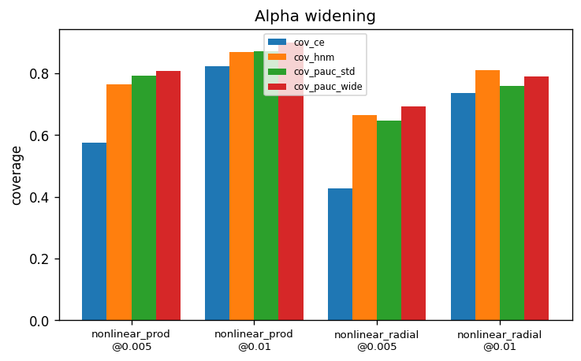

<!-- _class: lead -->

# `PAUCAtBudgetLoss`

## Optimizing recall at a fixed alert budget, not the whole curve

A ranking loss for extreme class imbalance — what it optimizes, why it wins when it wins, and when a weighted cross-entropy is still all you need.

*imbalanced-losses · for ML practitioners · 2026-07-15*

---

## The metric you actually deploy on

Alerting, fraud review, screening: you can only action the **top `b` fraction** of scores.

> **coverage@budget** — of all positives, what fraction land in the top `b` of scores (the **alert budget**, e.g. top 0.5% = "50 bps")? At extreme imbalance this is ≈ **recall at a fixed low FPR** (they coincide as positives become a negligible share of the population).

This is decided entirely at the **top of the score ranking**. Yet the losses we reach for don't optimize it there:

- **Cross-entropy (CE)** — calibrated per-sample likelihood; gradient spread across the whole distribution, dominated by easy negatives at extreme imbalance.
- **Smooth-AP / AUCPR** — the *whole* precision–recall curve.
- **Recall-at-Quantile** — a *single* threshold.

---

## The symptom that motivates a band loss

Improving the model — more capacity, more data, better features — can **raise mid-range AUCPR while leaving (or degrading) coverage at the operating point.**

The model gets better *in the bulk* and no better *where it is deployed*.

Whole-curve and per-sample objectives have no special pull on the top of the ranking, so gains land **where the mass is, not where the budget is.**

> If your objective is a **band of the ROC around a fixed budget**, optimize that band directly.

---

## The idea: optimize a region of the ROC

`PAUCAtBudgetLoss` sits between the two objectives you already know:

| objective | what it optimizes |
|---|---|
| `SmoothAPLoss` | the **whole** ROC/PR curve |
| **`PAUCAtBudgetLoss`** | a **band** `[α, β]` of the ROC at the budget |
| `RecallAtQuantileLoss` | a **single** threshold |



---

## What "partial AUC over a band" means

The band-restricted objective has a clean probabilistic reading — *the chance a positive outranks a negative, given that negative sits in the band:*

$$ \mathrm{pAUC}_{\text{norm}}(\alpha,\beta) = P\!\left(s_i > s_j \;\middle|\; i \in P,\; s_j \in \text{band}\right) $$

**where** $s$ = model score (logit) · $P$ = the positives · $s_i, s_j$ = a positive / negative score · **band** = negatives with FPR in $[\alpha, \beta]$ (score in $[t_\beta, t_\alpha]$) · $\mathrm{TPR}(u)$ = recall at FPR $u$.

Because the band holds exactly $(\beta - \alpha)$ of the negatives, that probability **equals the normalized area under the ROC inside the band**, $\int_\alpha^\beta \mathrm{TPR}(u)\,du \,/\, (\beta - \alpha)$ — a **consistent plug-in estimator** (more data → the true partial AUC), not a heuristic.

> `loss = 1 − pAUC` — training maximizes the outranking probability at the operating point.

---

## Band edges: iid-anchored, stop-gradient

The two edges are **score quantiles of the iid negatives**, detached (no gradient):

$$ t_\alpha = \mathrm{quantile}(\text{neg}_{\text{iid}},\, 1-\alpha), \qquad t_\beta = \mathrm{quantile}(\text{neg}_{\text{iid}},\, 1-\beta) $$

**where** $\mathrm{neg}_{\text{iid}}$ = the iid-flagged negatives · $\mathrm{quantile}(\cdot,\, 1-\alpha)$ = the score with a fraction $\alpha$ of negatives above it, so a threshold there has **FPR $= \alpha$** · *detached* = a stop-gradient constant.

A negative is "in the band" iff $t_\beta \le s \le t_\alpha$ — exactly FPR in $[\alpha, \beta]$.

- **iid-anchored** → $\beta$ keeps meaning *population FPR* even if the pipeline densifies the batch with hard negatives (edges don't move).
- **Recommended default $\alpha = 0,\ \beta = \text{budget}$** → $t_\alpha = \max(\text{neg})$, so the band covers **every** false-positive above the budget threshold.

---

## Two surrogates — and they behave differently

<style scoped>section { font-size: 24px; }</style>

**Trapezoid** (default) — lifts soft-TPR over detached thresholds; **gradient through positives only:**

$$ \mathrm{TPR}_k = \tfrac{1}{|P|}\sum_{i \in P}\sigma\!\big((s_i - t_k)/\tau\big), \quad \mathrm{pAUC}=\text{trapezoid}(\mathrm{TPR}_k) $$

> **Right tool when** the top is contested by hard *positives* you must lift over the threshold. It never suppresses negatives → **collapses when the top is contested by negatives.**

**Pairwise** — contrasts positives against the negatives *inside* the band, which **carry gradient:**

$$ \mathrm{pAUC} = \frac{1}{|P||B|}\sum_{i\in P}\sum_{j\in B}\sigma\!\big((s_i - s_j)/\tau\big), \quad B=\{\,j:\ t_\beta \le s_j \le t_\alpha\,\} $$

> **Right tool when** the top is contested by hard *negatives* — it **pushes the band negatives down.** Cost $O(|P| \cdot |\text{band}|)$.

**where** $\sigma$ = sigmoid (soft $\mathbf{1}[s_i > s_j]$) · $\tau = \tau_{\text{eff}}$ (next slide) · $t_k$ = detached FPR-knot threshold · $B$ = band negatives, $|P|, |B|$ their counts.

---

## Scale-aware temperature (why τ isn't a raw logit knob)

<style scoped>section { font-size: 24px; }</style>

$$ \tau_{\text{eff}} = \text{temperature} \times \text{scale} \qquad (\text{scale detached}) $$

**where** $\tau_{\text{eff}}$ = the sigmoid's width (the $\tau$ in every $\sigma(\cdot/\tau)$) · $\text{scale}$ = a robust spread of the iid negatives ($\mathrm{IQR}$, or band width $t_\alpha - t_\beta$).



> A fixed raw τ saturates *exactly when overfitting begins.* Tying $\tau_{\text{eff}} \propto \text{scale}$ keeps $(s - t)/\tau_{\text{eff}}$ constant as logits inflate → **scale-invariant** (loss identical, gradient cosine 1.0).

---

## Headline: *when* does it beat well-tuned CE?

Hold the **same two features** fixed; vary only the **functional form** of the cue separating positives from decoys at the top. Cue linearity — not capacity, ratio, or bulk difficulty — is the determinant:



CE captures a **linear** cue cheaply (+0.015); a **nonlinear** cue relevant only to the rare top → pairwise recovers **~+0.21**, replicated across two forms. *(8 seeds, bootstrap CIs.)*

---

## Two honest qualifiers (same study)

<style scoped>section { font-size: 25px; }</style>

Both come straight from the ablation — the win is **narrow and conditional**:

| | |
|---|---|
|  |  |
| **Operating-point specific.** AUROC stays ~0.99 across cells — coverage@budget moves, the whole-curve ranker does *not* get better. | **Budget-dependent.** The nonlinear lift falls **+0.216 @ 50 bps → +0.045 @ 100 bps.** A wider budget is easier for CE. |

> Largest at the **tightest** budgets — needs an MLP, CE warmup, and temperature annealing.

---

## Surrogate choice is not free

Within the favorable (contested-negative-top) regime, **only `pairwise` survives**:



- **pairwise** (green) carries the advantage — it suppresses the band negatives.
- **trapezoid** (red) collapses to the trivial floor — lifts positives only.
- `SmoothAP` (purple) — strong whole-curve baseline, but not at the operating point.

---

## Why it wins: the band *is* a hard-negative miner



The pairwise band contrasts each positive against the negatives at the top of the ranking — **by construction those are the decoys.** On identical data and scores:

- Band is **~73% decoys against a 1.2% base rate** — **~60× enrichment**, with **no decoy labels.**
- PAUC puts **~96% of negative-gradient mass on decoys** vs **~58% for CE.**

---

## It's allocation, not capacity — and CE can copy it

If PAUC merely *represented* the cue better, concentrating CE's gradient wouldn't help. **It does:**

| variant | coverage@50bps | note |
|---|---:|---|
| Weighted CE | 0.576 | baseline |
| CE + oracle decoy up-weight ×10 | 0.767 | *uses* decoy labels |
| CE + label-free top-score HNM | 0.765 | no labels — mines the top negatives |
| **PAUC pairwise** | **0.792** | adaptive, label-free |

> **Honesty:** a label-free hard-negative-mined CE reproduces most of the gap (matches/beats PAUC in 3 of 4 cells). The partial-AUC objective has **no higher ceiling** here — its edge is delivering the concentration **adaptively, without a tuned factor or labels.**

---

## One knob that matters: don't let decoys escape the band

The decoys pile up at the very top — but gradient only reaches `[α, β]`. The **old** default `[budget/2, 1.5·budget]` let **21–41% of decoys escape above `t_α`** (no gradient).



> Lowering **`α → 0`** widens the band to `t_α = max(neg)`, covering the escaped decoys: **+0.017 to +0.056** per cell. The sweep's robust optimum — **`α = 0, β = budget`** — is now the default.

---

## When to reach for it — and when not

**Use `PAUCAtBudgetLoss` when:**

- Deployment metric is **recall at a fixed low FP budget** (alerting, fraud, screening).
- The top is **contested by hard negatives** → `surrogate="pairwise"`.
- Pool (batch + queue + DDP gather) holds **≫ `1/β`** iid negatives.

**Prefer something else when:**

- The top is **cleanly separable** → well-weighted CE or `SmoothAPLoss` is hard to beat.
- You care about the **whole** ranking → `SmoothAPLoss`; a **single threshold** → `RecallAtQuantileLoss`.
- The pool can't supply a stable band-edge quantile at your `β`.

---

## Configuration cheat-sheet

<style scoped>section { font-size: 25px; }</style>

| situation | setting |
|---|---|
| **band** (start here) | `alpha=0.0, beta=budget` (e.g. `beta=0.005` @ 50 bps) |
| contested-negative top | `surrogate="pairwise"`, `pos_numerator="pool"` |
| non-contested top, few live positives + big queue | `surrogate="trapezoid"`, `pos_numerator="live"` |
| stability | `tau_scale="iqr"`, `temperature≈0.1` |
| wide / volatile band | `tau_scale="band"`, `temperature≈1.0` |

- Train it with **CE warmup → blend → PAUC** (temperature anneal ~0.5→0.1) via `LossWarmupWrapper`.
- Watch `band_neg_count` (band populated?) and `grad_pos_count` (positives carrying gradient?) with `return_diagnostics=True`.

---

## Run it in one command

```python
from imbalanced_losses import PAUCAtBudgetLoss

loss_fn = PAUCAtBudgetLoss(
    num_classes=1,            # binary
    alpha=0.0, beta=0.005,    # 50 bps budget
    surrogate="pairwise",
    pos_numerator="pool",
    queue_size=1024,          # stabilizes the tail quantile
    temperature=0.1,
)
loss = loss_fn(logits, targets)   # [N,1], targets in {0,1}
loss.backward()
```

```bash
python examples/coverage_at_budget_demo.py --n-seeds 8 --epochs 20
# Weighted CE 0.573  →  PAUC pairwise 0.772   (+35% coverage@50bps, seed-stable)
```

---

## Limitations — read before adopting

- **Strong baseline.** Weighted CE is hard to beat on separable tops; wins are **regime-specific** and, on synthetic data, modest and seed-noisy.
- **Surrogate is regime-dependent.** No single dominant surrogate (trapezoid ↔ non-contested, pairwise ↔ contested). `pos_numerator` flips with it — a real config burden.
- **Tail-quantile sensitivity.** Small pools give a biased, jittery band edge. Needs pool ≫ `1/β`.
- **No large-scale benchmark validation.** Evidence = controlled synthetic studies + one small real dataset; not validated against published deep-pAUC methods.

> Gated on a **per-deployment adoption diagnostic** and **validation on real data** before rollout.

---

<!-- _class: lead -->

# Takeaways

**Optimize the band you deploy on.** `PAUCAtBudgetLoss` targets coverage@budget directly.

**It wins when the top is contested by a cue CE under-learns** — pairwise surrogate, wide band (`α=0`), ~+0.21 in the favorable regime.

**The mechanism is gradient allocation** — a label-free HNM-CE gets you most of the way; PAUC delivers it adaptively, without labels.

*Deep dive: `docs/explanation/pauc-at-budget-deep-dive.md` · Study: `lab/pauc_vs_ce_regimes/`*
