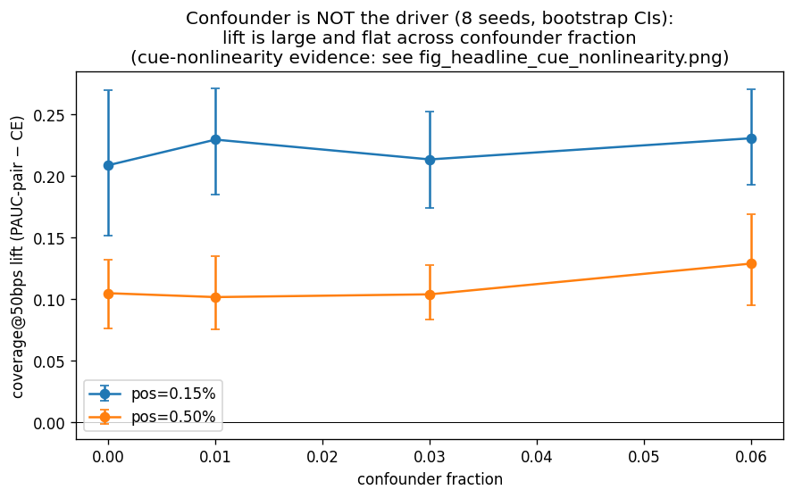
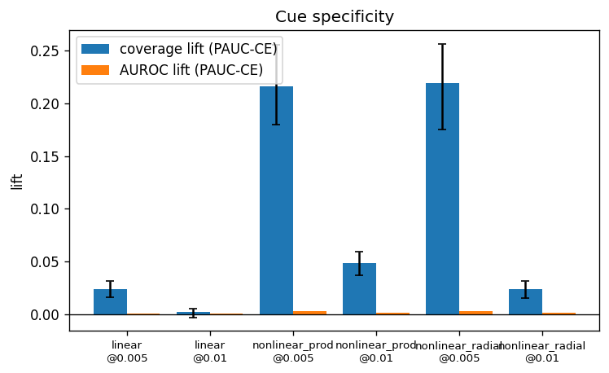
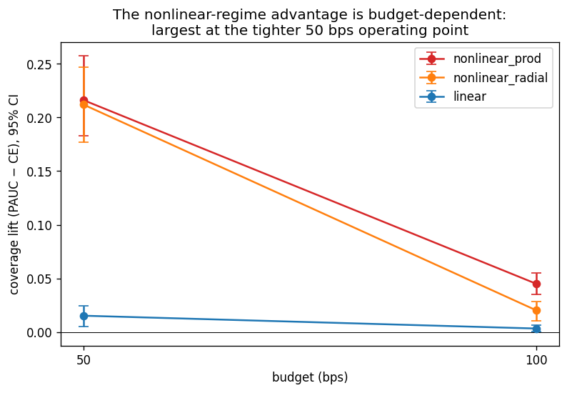
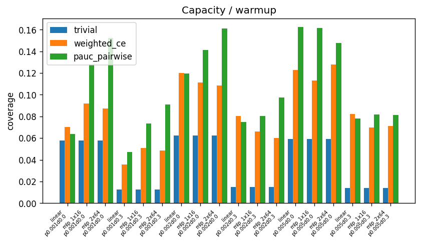
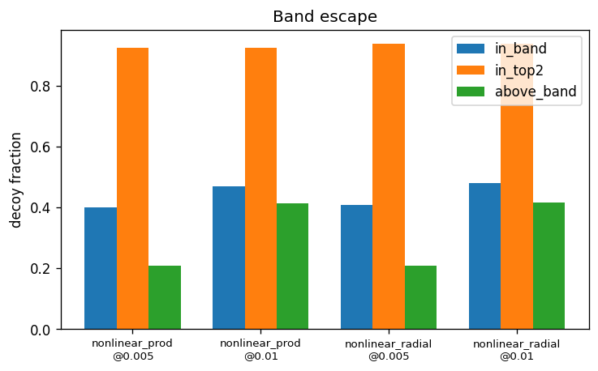

# When `PAUCAtBudgetLoss` Beats Cross-Entropy on Coverage-at-Budget

## Abstract

`PAUCAtBudgetLoss` (pairwise surrogate, `pos_numerator="pool"`) lifts coverage@budget — recall at a
fixed 50 bps false-positive budget — by **+0.216 [+0.183, +0.257]** (≈+38%) over a validation-selected,
well-tuned cross-entropy baseline when the operating point is contested by a **nonlinear, rarely-relevant
cue that cross-entropy under-learns**. A **linear** cue built from the same two discriminative features,
under the same protocol, yields only **+0.015 [+0.005, +0.024]**, and the large effect replicates under a
second, distinct nonlinear form (radial cue, **+0.212 [+0.177, +0.247]**) — isolating the cue's *functional
form* (linear vs interaction) at the same two features as the driver. The advantage
is operating-point specific (AUROC ≈ 0.99 throughout), carried only by the pairwise surrogate (the
trapezoid surrogate collapses to the trivial floor), and budget-dependent (the nonlinear-product lift falls
to +0.045 [+0.035, +0.055] at 100 bps). The advantage is a **gradient-allocation** effect — PAUC
concentrates gradient on the operating-point negatives — that a simple **label-free hard-negative-mined
cross-entropy reproduces, matching or beating PAUC in three of four tested cells** (§3); the win is not
specific to the partial-AUC objective. The recommendation is to **try a hard-negative-mined cross-entropy
first**, and adopt `PAUCAtBudgetLoss(surrogate="pairwise", pos_numerator="pool")` with cross-entropy warmup
and temperature annealing where its adaptive, label-free band is preferred — for contested-top,
extreme-imbalance problems where the operating-point distinction is plausibly a cue a pointwise loss
under-learns, gated on a per-deployment adoption diagnostic and validated on real data before rollout.

## Reproducibility

The canonical reproducer for all results is the Metaflow pipeline at `flow/pauc_flow.py` (config in
`conf/`, validator at `flow/validate.py`). Run any slice with:

```bash
uv run flow/pauc_flow.py --config-value cfg "hydra_overrides: [experiment=<name>]" run
# capacity slice also needs: geometry=hard_bulk,training=capacity
# confounder slice also needs: geometry=confounder
```

Results are Metaflow run artifacts — query via `Run('PaucFlow/<id>')` or validate with
`flow/validate.py <experiment>`. The pipeline reproduced 7/8 slices' published numbers within
CI/seed-noise; the capacity forensic sub-studies (LR-artifact, warmup-only, warmup-vs-cold) are
intentionally not reproduced (see §2.5).

## 1. Methods

### 1.1 Question

`PAUCAtBudgetLoss` optimizes a normalized partial AUC over a low-FPR band anchored at a deployment budget.
The question is the operating regime in which this band-restricted objective beats a strong pointwise
baseline on the metric it directly targets, coverage@budget, and the mechanism that makes it do so. The
sharpened hypothesis the evidence supports is conditional: the pairwise surrogate beats well-tuned
cross-entropy on coverage@budget if and only if the operating point is contested by a cue cross-entropy
under-learns — specifically a cue that is hard to represent (nonlinear) and relevant only to the rare top,
so the bulk-dominated cross-entropy gradient never invests in it.

### 1.2 Subject and surrogates

The subject is `PAUCAtBudgetLoss` in two surrogate variants. The **pairwise** surrogate gives gradient to
the band negatives: the specific near-threshold negatives occupying the `[α, β]` FPR band are pushed below
the positives. The **trapezoid** surrogate gives gradient through positives only: positives are lifted over
detached negative-quantile thresholds, but band negatives are not directly suppressed. These experiments
deliberately use the older band convention, set relative to the budget (α = budget/2, β = 1.5 × budget)
using detached iid-negative quantiles; the library default has since changed (v0.4.1) to α = 0, β = budget,
which matches this report's own recommendation (§3, Appendix A). The pairwise
surrogate additionally requires `pos_numerator="pool"`, which pools positives across the memory queue; the
`"live"` setting starves the pairwise numerator at extreme imbalance (about 4.4 live positives per batch at
0.15% positive rate).

Concretely, both surrogates minimize `loss = 1 − pAUC`, a soft normalized partial AUC over the band. Let
`P` be the (pooled) positive set, `s_i` a logit, `τ = temperature · scale` the scale-aware sigmoid
temperature (`scale` a detached robust dispersion of the negatives), and let `t_α`, `t_β` be the
*detached* negative-score quantiles at FPR α and β (`t_α > t_β`). The **pairwise** surrogate scores
positives against the negatives `B` falling inside the band `[t_β, t_α]`,

$$
\mathrm{pAUC}_{\text{pairwise}} = \frac{1}{|P|\,|B|} \sum_{i \in P} \sum_{j \in B} \sigma\!\left(\frac{s_i - s_j}{\tau}\right), \qquad B = \{\, j \text{ negative} : t_\beta \le s_j \le t_\alpha \,\},
$$

so gradient flows to both the positives and the band negatives `B` (the latter is what makes it adaptive
hard-negative mining, §3). The **trapezoid** surrogate instead integrates a soft TPR over a uniform FPR
grid `α = f_0 < … < f_{K−1} = β` with detached thresholds `t_k` = the `(1 − f_k)` negative quantile,

$$
\begin{aligned}
\mathrm{TPR}_k &= \frac{1}{|P|} \sum_{i \in P} \sigma\!\left(\frac{s_i - t_k}{\tau}\right), \\[2pt]
\mathrm{pAUC}_{\text{trapezoid}} &= \frac{1}{K-1}\left[\, \tfrac{1}{2}\mathrm{TPR}_0 + \sum_{k=1}^{K-2} \mathrm{TPR}_k + \tfrac{1}{2}\mathrm{TPR}_{K-1} \,\right].
\end{aligned}
$$

which gives gradient through the positives only — the thresholds `t_k` are detached, so band negatives are
never directly suppressed. This positives-only gradient path is why the trapezoid surrogate collapses in the
contested-top regime (§2.3).

### 1.3 Metric

The primary metric is **coverage@budget**: recall at a fixed low FPR budget, evaluated on a held-out test
split. This is the deployment metric the loss directly optimizes. Two equivalent estimators appear in the
code: the headline and mechanism scripts use the **top-k** form (recall among the top `⌈budget·N⌉` scores,
the alert budget directly), while the regime-map and capacity grids use the **TPR-at-FPR-quantile** form. At extreme
imbalance these nearly coincide; the top-k form judges every method at a slightly stricter effective FPR
(≈0.0038–0.0041 vs the nominal 0.005), so the headline lifts are mildly conservative (lower bounds) and the
sign of every result is unaffected. The primary budget is
**50 bps**; the headline result is established at two budgets, 50 and 100 bps. AUROC and average precision
(AUCPR) over the full curve are reported as secondary, regime-specificity metrics — they establish that the
advantage is operating-point specific rather than a globally better model, and are labeled secondary in
every results table. Uncertainty is bootstrap percentile confidence intervals on every primary metric and on
the paired lift (PAUC − CE). For the headline ablation the intervals bootstrap-resample the 8 per-seed paired
differences; a lift counts as a win or loss only if its interval excludes zero.

### 1.4 Comparator and tuning

The comparator is **well-tuned cross-entropy** (best-vs-best). The `pos_weight` is swept over class-ratio
multiples and weight decay over {0, 1e-4, 1e-3}, with the configuration selected per cell per seed on a
held-out validation split and reported on a disjoint test split. `PAUCAtBudgetLoss` is tuned symmetrically
(temperature and weight decay, validation-selected). A trivial baseline (single most-informative raw
feature) is present in every cell, and coverage@budget must beat it for any method to count as a model.
`SmoothAPLoss`, a whole-curve average-precision surrogate, is included as an independent strong ranking
baseline that sees the same data but is not tied to the band.

Two operationalization constraints are fixed design choices that do not undermine validity. First, both PAUC
surrogates are trained via `LossWarmupWrapper` — cross-entropy warmup for the first fraction of epochs, then
the PAUC main loss with temperature annealing (0.5 → 0.1) — under the same total epoch budget as standalone
cross-entropy. This isolates the ranking objective from a cold-start saturation failure rather than conferring
a tuning advantage; the warmup effect is quantified directly (§2.5). Second, both losses are tuned and reported
on disjoint validation and test splits, and validation selection automatically rejects saturated PAUC
configurations.

### 1.5 Evaluation construction

Throughout, **the cue** denotes the *operating-point separator*: the discriminative feature pattern, living
in a small fixed set of features, that distinguishes true positives from the hard "decoy" negatives crowding
the operating point. It is defined in contrast to the bulk signal — the bulk signal lifts both positives and
decoys to the top of the ranking and so cannot tell them apart, whereas the cue is the residual signal that
does. The cue is also *rarely relevant* (it only separates the rare top decoys), so it contributes little to
the average loss; "a cue cross-entropy under-learns" means this separator is nonlinear and rarely relevant,
so a bulk-dominated gradient never invests in representing it.

The decisive evaluation is a controlled cue ablation (the `cue_ablation` slice, `conf/experiment/cue_ablation.yaml`; positive rate 0.15%; MLP encoder;
8 seeds; bootstrap-over-seed paired CIs; confounder fraction 0). The data has an easy bulk signal that lifts
positives and decoys to the top of the score distribution (AUROC ≈ 0.99), but the cue (on two fixed features)
that distinguishes positives from the decoys is varied across three matched cues. All three cues are built
from the **same two discriminative features**; only the cue's functional form varies. A **linear** cue at
those two features is compared against two **distinct nonlinear** cues at the same two features — a product
(`f5·f6`) and a radial form. This isolates the cue's *linearity* as the manipulated variable while holding
the underlying features fixed. Two near-positive negative populations are distinguished in the
construction: **decoys** carry the easy bulk signal but lack the operating-point cue (they make the top
contested), and **confounders** carry the operating-point cue without the easy signal (they make over-using
the cue costly to the bulk). The confounder fraction is the swept axis in a companion experiment
(the `confounder_sweep` slice, `conf/experiment/confounder_sweep.yaml`; ≥450 test positives per cell), which tests whether bulk-cost rather than cue
nonlinearity is the driver. All evidence is synthetic.

### 1.6 Headline configuration

The headline result (§2.1) uses a single fixed configuration (the `cue_ablation` slice, `conf/experiment/cue_ablation.yaml`): 20-dim Gaussian
features (bulk signal +2.5 on features 0–2 for positives and decoys; cue magnitude 1.7 on features 5–6);
positive rate 0.15%; decoy fraction 0.012; train/test = 150k/300k (≈225/450 positives); MLP 20→64→64→1;
Adam, lr 1e-3, weight decay 0, 15 epochs, batch 4096, 8 seeds. CE is `BCEWithLogitsLoss` with `pos_weight`
= class ratio. PAUC is `PAUCAtBudgetLoss(surrogate="pairwise", pos_numerator="pool", queue_size=8192,
α=budget/2, β=1.5·budget)`, trained as CE-warmup (30% of steps) → blend (15%) → PAUC with temperature
annealing 0.5→0.1; bootstrap CIs N=1000 over the 8 per-seed paired differences. This config is fixed (not
validation-tuned) to isolate the cue-linearity effect; the **best-vs-best validation-selected** comparison
(§1.4) runs in the companion sweep and reproduces the same magnitude (+36–43%), so the result is not a
CE-undertuning artifact — a fully tuned CE only narrows, never closes, the gap.

## 2. Results

### 2.1 Cue nonlinearity is the binding variable

The controlled ablation isolates the cue's linearity as the driver of the advantage. Holding the two
discriminative features fixed and varying only the cue's functional form, the **linear** cue yields only
**+0.015 [+0.005, +0.024]** at 50 bps (CE 0.864 → PAUC 0.880), while the **nonlinear-product** cue lifts
coverage by **+0.216 [+0.183, +0.257]** (CE 0.575 → PAUC 0.791, ≈+38%) and the **nonlinear-radial** cue by
**+0.212 [+0.177, +0.247]** (CE 0.426 → PAUC 0.638).

| Cue (50 bps) | CE coverage | PAUC-pairwise | Lift [95% CI] |
|---|---:|---:|---|
| **linear** (same two features) | 0.864 | 0.880 | **+0.015 [+0.005, +0.024]** |
| **nonlinear, product** (`f5·f6`) | 0.575 | 0.791 | **+0.216 [+0.183, +0.257]** |
| **nonlinear, radial** (distinct nonlinear form) | 0.426 | 0.638 | **+0.212 [+0.177, +0.247]** |

The cue's linearity is the determinant. With the two features held fixed, a linear cue produces a small lift
while both nonlinear cues produce a roughly order-of-magnitude larger lift, and the effect replicates across
two distinct nonlinear forms (product and radial) with intervals that do not overlap the linear cue's. The
mechanism is gradient allocation, not capacity: a linear cue is cheap for cross-entropy to capture, so its
coverage stays high (0.86) and little is left to recover; a nonlinear cue relevant only to the rare top is one
cross-entropy's bulk-dominated gradient never invests in (coverage 0.43–0.58), and the band-focused PAUC
gradient drives the MLP to learn it. The linear cue's nonzero +0.015 lift is itself informative: even a cheap
cue leaves a sliver of operating-point coverage unrealized, but at a magnitude an order of magnitude below the
nonlinear case on which the thesis rests.


The confounder hypothesis — that the advantage scales with the bulk-cost of the cue — is false. In the powered
confounder sweep the PAUC-pairwise lift is large and flat across confounder fraction: at positive rate 0.15% it
is +0.209 [+0.151, +0.270] (+36%) at confounder 0, rising to +0.231 [+0.193, +0.271] (+43%) at confounder 0.06,
with all four cells CI-separated; at positive rate 0.5% it is +0.10–0.13 across the same range. At confounder 0
PAUC already wins +36% (0.786 vs 0.577), so the confounder is not the mechanism. The lift is larger at higher
rarity (0.15% ≈ +36–43% vs 0.5% ≈ +17–23%), so rarity amplifies the effect within the favorable regime. The
binding variable is cue nonlinearity, not bulk-cost.



This unifies the investigation. An earlier construction used a *linear* operating-point cue and measured a
small advantage (~+0.01–0.015); this is the no-advantage end of the same nonlinearity axis — cross-entropy
captures a linear cue cheaply, leaving little for the band-focused gradient to recover. The earlier readings
that the advantage "needs a limited-capacity linear model" or that "contestedness is the switch" were artifacts
of the linear-cue construction, superseded by the controlled ablation. The whole investigation collapses to one
variable: whether the operating-point cue is one cross-entropy under-learns.

### 2.2 The advantage is operating-point specific

The advantage is confined to the operating point. AUROC is ≈ 0.99 across all three ablation arms while
coverage@budget moves by up to 0.22: for the nonlinear-product cue, AUROC is 0.994 (CE) vs 0.997 (PAUC) while
coverage moves 0.575 → 0.791. The pairwise surrogate also lifts AUCPR in the nonlinear regime (0.551 vs CE
0.269 for the product cue; 0.325 vs 0.125 for the radial cue), consistent with a nonlinear cue that improves
precision at the top once learned while AUROC remains saturated and uninformative. The linear-cue contrast
geometry shows the same separation even more cleanly — coverage lifts where they occur are CI-separated while
AUROC lift is ≈ 0 everywhere. `PAUCAtBudgetLoss` is operating-point specific, not a uniformly better ranker.



### 2.3 Only the pairwise surrogate works

The advantage is carried entirely by the pairwise surrogate. In the nonlinear regime the trapezoid surrogate
collapses to the trivial floor (coverage ~0.38, indistinguishable from the trivial baseline ~0.37) because
positives-only gradient cannot suppress the near-threshold band negatives that contest the operating point. In
the linear hard-bulk contrast geometry the trapezoid surrogate is worse than cross-entropy by 0.06–0.11
coverage. The whole-curve `SmoothAP` baseline is strong (~0.72 coverage in the nonlinear regime) but is beaten
on coverage@budget by pairwise (~0.79), as expected for a whole-curve objective that does not concentrate
capacity at one operating point. For the pairwise surrogate, `pos_numerator="pool"` is required: pooling keeps
enough positives in the pairwise contrast, whereas `"live"` starves it at extreme imbalance and collapses
coverage. The surrogate choice dominates the loss's behavior.


### 2.4 The advantage is budget-dependent

The nonlinear-regime advantage is largest at the tighter operating point. For the nonlinear-product cue the
lift is **+0.216 [+0.183, +0.257]** at 50 bps and **+0.045 [+0.035, +0.055]** at 100 bps; the radial cue shows
the same pattern (+0.212 at 50 bps → +0.020 [+0.010, +0.028] at 100 bps). The linear cue is small at both
budgets. Both budgets are CI-separated from zero, so the budget-dependence is measured rather than assumed: the
large gains require both a cross-entropy-under-learned cue and a tight enough budget.



### 2.5 Capacity and warmup are preconditions, not levers

The nonlinear cue is not linearly separable, so an MLP is a precondition for representing it at all; capacity is
needed to *represent* the cue, not a general lever for the advantage. This is distinct from an earlier reading,
established at one positive rate on the linear-cue geometry, that higher capacity confers a PAUC advantage. A
fair powered re-evaluation overturns that reading: the apparent MLP degradation of coverage is largely a learning-rate
artifact (cross-entropy MLP coverage recovers from 0.101 to 0.133, matching the linear model's 0.135, at LR
1e-4; the default-LR validation curve peaks then degrades monotonically), and the apparent PAUC MLP edge is the
cross-entropy warmup acting as implicit early-stopping (cross-entropy-warmup-only MLP coverage 0.099 ≈
PAUC-warmup MLP 0.099). The warmup itself is a stability precondition, not a coverage lever at the final
operating point: warmup vs cold PAUC is +0.024 [+0.016, +0.033] at MLP capacity, and cold low-temperature
training catastrophically saturates (coverage 0.003, the model never learns the contest direction). The
surviving capacity claim is the precise one: the MLP is required to represent the nonlinear cue, and
cross-entropy's failure there is gradient allocation rather than capacity.

> **Pipeline note.** The `capacity_warmup` slice (`conf/experiment/capacity_warmup.yaml`,
> `geometry=hard_bulk`, `training=capacity`) reproduces the coverage-by-capacity result. The three
> forensic sub-studies — the LR-artifact probe, the warmup-only comparison, and the warmup-vs-cold
> ablation — are **intentionally not reproduced**: they only existed to debunk a Cycle-1 setup artifact
> the reimplementation never makes.





### 2.6 Boundary conditions — where the advantage vanishes

The advantage is regime-conditional and disappears outside the favorable regime.

- **Linear / cheap cue.** When the operating-point separator is linear, well-tuned cross-entropy captures it
  (coverage 0.86) and PAUC adds at most +0.015. This is the single largest moderator, shrinking the ~+0.21
  nonlinear win by roughly an order of magnitude.
- **Uncontested top.** With no contesting negatives at the operating point there is no band to suppress and
  PAUC ties cross-entropy.
- **Tight budget.** In the nonlinear regime the advantage shrinks but stays positive and CI-separated as the
  budget tightens from 100 to 50 bps; behavior below 50 bps in this geometry is uncharacterized. In the
  separate linear hard-bulk geometry, a 10 bps budget reverses the sign (PAUC loses, CI-separated) because the
  tail quantile anchoring the band is too sparse to estimate. These are distinct geometries; the linear 10 bps
  reversal is not evidence about the nonlinear regime.
- **High positive rate.** At 20% positives there is no budget-region scarcity; cross-entropy is strong and
  PAUC's loss there is expected and outside the intended extreme-imbalance domain.
- **Cold start / surrogate saturation.** Without cross-entropy warmup at low temperature the pairwise surrogate
  saturates (coverage 0.003). The `live` `pos_numerator` is a related failure that starves the pairwise
  contrast.

Where the protocol is clean: nonlinear contested top, extreme imbalance (≤ ~0.5%), budget ≥ 50 bps, MLP
capacity, pairwise surrogate with `pos_numerator="pool"`, cross-entropy warmup, and temperature annealing.
There the nonlinear-cue lift is +0.21 (≈+38%) at 50 bps, CI-separated, replicated across two nonlinear forms,
and it grows with rarity.

## 3. Mechanism: adaptive hard-negative mining at the operating point

The advantage is a **gradient-allocation** effect. The pairwise surrogate contrasts positives against the
negatives whose scores fall in the FPR band around the budget; by construction those band negatives are
the decoys (the only negatives that reach the top), so most of the loss's gradient is spent on the
positives-versus-decoy contrast — the comparison the nonlinear cue is needed for. Cross-entropy, optimizing
average log-loss, treats decoys as ~1.2% of negatives and does not concentrate there. This is established
on the **identical** headline data (the `mechanism_probe` slice, `conf/experiment/mechanism_probe.yaml`:
same generator, constants, and RNG seed as the nonlinear-product headline cell; CE 0.576 and PAUC 0.792 match the headline 0.575 / 0.791), 8 seeds.

The PAUC band is **73% decoys against a 1.2% base rate** (≈60× enrichment; the band selects the decoys
with no decoy labels), and PAUC places **96% of its negative-gradient mass on decoys versus 58% for
cross-entropy** on identical scores. Giving cross-entropy the same concentration closes the gap: an
**oracle decoy up-weight ×10** reaches **0.767** and a **label-free top-score hard-negative-mining** rule
reaches **0.765**, against PAUC's **0.792** and CE's **0.576** — recovering ~90% of the advantage (the
−0.216 gap collapses to ≈ −0.025). The effect is allocation, not representational capacity: a linear probe
separating positives from decoys on penultimate activations scores **0.895 (CE) versus 0.910 (PAUC)** —
nearly equal, so both models encode the cue and differ only in whether the objective acts on it at the
budget. Crude over-concentration degrades a pointwise loss (oracle ×30 < ×10 in every cell; ×50 → 0.702,
×200 → 0.632), whereas the bounded pairwise contrast with an adaptively tracking band does not.

The mechanism transfers across cue form and budget. Re-run on the radial cue and at 100 bps on identical
data (the `mechanism_transfer` slice, `conf/experiment/mechanism_transfer.yaml`; radial CE 0.427 matches the headline 0.426), concentrating cross-entropy's
gradient closes the CE→PAUC gap in all four cells (product/radial × 50/100 bps): ≈89% in the product/50-bps
cell — the one cell where concentrated cross-entropy does not overshoot — and past 100% in the other three,
where it overshoots PAUC outright, with the PAUC band 52–82% decoys throughout. PAUC's small +0.025 edge over concentrated cross-entropy is specific to the
product/50-bps cell and does not generalize: the label-free top-score hard-negative-mined cross-entropy
matches or beats PAUC in three of the four cells (product 100 bps 0.870 vs 0.866; radial 50 bps 0.664 vs
0.638; radial 100 bps 0.809 vs 0.755). The win is therefore a gradient-allocation effect that a simple,
label-free hard-negative-mining rule reproduces and often exceeds; the partial-AUC objective's distinct
contribution is delivering that concentration adaptively and stably without a tuned mining factor or
decoy labels, not a categorically higher ceiling. Figures: `figures/fig_mechanism.png`, `figures/fig_mechanism_transfer.png`.

The cells where PAUC trails HNM are explained geometrically by the older-convention band these
experiments use, and the gap is closed by one knob. The decoys pile at the top of the negative score distribution, but PAUC's pairwise gradient
only reaches the thin FPR band `[α, β] = [budget/2, 1.5·budget]`: that band contains only **40–48% of
decoys**, while **21% (50 bps) to 41% (100 bps) escape above it** (above `t_α`) and receive no gradient,
whereas HNM's top-2% captures **92–94%** (the `band_vs_hnm` slice, `conf/experiment/band_vs_hnm.yaml`; 8 seeds, bootstrap CIs ±1–2 pts).
Lowering `α` toward 0 widens the band to
cover the escaped top decoys (here `β` is held at the older convention's `1.5·budget`; Appendix A sweeps both edges
and finds tightening `β` to `budget` helps further), and this **improves PAUC in every cell (+0.017 to +0.056 over the older band)**
and makes wide-band PAUC match or beat HNM in three of four cells (product 50 bps 0.808, product 100 bps
0.894, radial 50 bps 0.694; behind only at radial 100 bps, 0.786 vs 0.809; the `alpha_widen` slice,
`conf/experiment/alpha_widen.yaml`; `figures/fig_alpha_widen.png`). A full band sweep over both edges and four positive rates (Appendix A) finds the
robust optimum at **α = 0, β = budget** — the band of false-positives at the budget — with the former default
`[budget/2, 1.5·budget]` in the poorly-performing high-α region (worst cell `α=budget/2, β=2.5·budget`); the gain is concentrated at `pos_rate ≪ budget` and vanishes
once `pos_rate ≥ budget` (coverage@budget capped at `budget/pos_rate`). The older convention's `α = budget/2` is
therefore too conservative for this regime: it excludes the highest-scoring negatives by construction.
Label-free HNM-CE and PAUC with a sufficiently wide band are roughly equivalent implementations of the
same gradient-concentration mechanism.

## 4. Deployment

The gain is real where the regime holds and ~zero otherwise, while the loss adds training complexity and
failure modes. The deployment posture is therefore gated and verifiable per deployment.

- **Step 0 — adoption diagnostic.** Train well-tuned cross-entropy and measure coverage@budget on a labeled
  holdout. Probe headroom: does a higher-capacity model or a `SmoothAP`/ranking probe reach materially higher
  coverage@budget at the same budget? If cross-entropy is already near the achievable ceiling (the cue is
  linear/cheap, or the top is uncontested), ship cross-entropy. Only if cross-entropy demonstrably leaves
  coverage@budget unrealized at a contested operating point does adoption proceed.
- **Step 1 — configure.** PAUC-pairwise + cross-entropy warmup (≈30%) + temperature annealing (≈0.5 → 0.1) +
  `pos_numerator="pool"` + `queue_size` large enough to resolve the band's smaller nonzero edge — ≫ 1/β
  (≈200 at a 50 bps budget with β = budget); 1/α applies only when α > 0 — on a model with enough capacity
  to represent the cue, selecting hyperparameters on validation coverage@budget.
- **Step 2 — deploy with a fallback.** The cross-entropy-warmed checkpoint is always available from the warmup
  phase; if PAUC training destabilizes or holdout coverage@budget regresses, ship cross-entropy. Roll out via
  shadow then canary, promoting only on a CI-separated coverage@budget gain, with rollback on coverage not
  exceeding cross-entropy or false-alarm budget exceeded.

Inference latency is identical to a cross-entropy-trained model (the loss is a training-time choice). The
operating-point threshold is a negative-score quantile that must be recalibrated each cycle, and retraining
should trigger on operating-point drift (monitored coverage@budget on a labeled holdout) rather than on a
calendar or on AUROC, since the most drift-sensitive region is the tail the metric depends on. The dangerous
failure is silent — cold-start saturation collapses coverage to the trivial floor while loss and AUROC look
fine — so every retrain is gated behind a coverage@budget check before promotion.

## 5. Limitations

**Synthetic data only.** All geometries are synthetic, and the favorable regime (easy bulk, nonlinear
rarely-relevant cue, contested top) is constructed; it may not occur, or may not occur in this form, in real
alerting or fraud data, so the large wins could be specific to the construction. The win is fully explained by
one controllable, isolated property (cue nonlinearity) and replicates across two distinct nonlinear forms,
which indicates a general mechanism rather than a single-dataset fluke, but no real dataset was evaluated. The
recommendation is gated on real-data validation, and the mechanism is stated as a falsifiable condition a
real-data study can test directly.

**Bootstrap-over-8-seeds intervals are coarse.** The headline intervals bootstrap-resample 8 per-seed paired
differences, and an 8-element bootstrap has coarse, somewhat anti-conservative tail behavior, so the percentile
interval is approximate at its endpoints even when it excludes zero. The nonlinear lifts (~+0.21) are large
relative to the within-seed standard deviation and the nonlinear-versus-linear separation (roughly an order of
magnitude, non-overlapping intervals) is not in doubt at this resolution; the residual uncertainty is in exact
endpoints, not direction.

**Multiple comparisons; one inference framework.** The exploratory regime map made per-cell win/loss calls across
a 72-cell grid with no family-wise or false-discovery correction, so individual marginal grid cells (lifts
~+0.01) are weak evidence — which only sharpens the position that the linear-cue advantage is negligible. The
headline and mechanism claims rest on large, isolated effects (~+0.21; ~10× linear-vs-nonlinear separation),
not on marginal grid cells. All inference is bootstrap percentile CIs; no non-parametric test (sign or
Wilcoxon over seeds) was run as independent corroboration.

**Two budgets and a single ablation positive rate.** The nonlinear-cue result is characterized at 50 and 100
bps, so behavior at tighter budgets in this geometry is unknown; across the two measured budgets the advantage
is monotone in budget, so the operating-point dependence is measured rather than assumed. The controlled
ablation fixes the positive rate at 0.15%; the companion confounder sweep extends the effect to 0.5% (+17–23%),
so the favorable-regime finding spans two rarities, but the nonlinear-cue result — shown across two distinct
nonlinear forms (product and radial) against a linear cue at the same two features — is established at a single
positive rate and two budgets.

**Two nonlinearities tested.** The nonlinear cue is a specific feature interaction; other nonlinearities
(higher-order interactions, other boundaries) might behave differently. The ablation replicates across two
distinct forms (product and radial) against a linear cue at the same two features, which is stronger than a single-form result,
but the claim is scoped to "a cue cross-entropy under-learns (hard to represent, relevant only to the rare
top)" rather than to all nonlinearities.

**Closed-loop synthetic evaluation.** The generator, metric, and loss share assumptions, so the evaluation
could in principle reward the loss for matching the generator. The result survives a strong independent
whole-curve baseline (`SmoothAP` ~0.72) and a well-tuned cost-sensitive cross-entropy that see the same data,
reducing but not eliminating this confound; full mitigation requires real-data validation.

## 6. Conclusion and Recommendation

The evidence establishes that `PAUCAtBudgetLoss(surrogate="pairwise", pos_numerator="pool")` with
cross-entropy warmup and temperature annealing beats well-tuned cross-entropy on coverage@budget by a large,
CI-separated margin (+0.216 [+0.183, +0.257] ≈ +38% at 50 bps) exactly when the operating point is contested by
a cue cross-entropy under-learns — a nonlinear, rarely-relevant separator the bulk-dominated gradient never
invests in. The cue's linearity, not bulk-cost or model capacity, is the binding variable: holding the two
discriminative features fixed, a linear cue yields only +0.015 while two distinct nonlinear forms each yield
~+0.21, the advantage is confined to the operating point (AUROC ≈ 0.99), it is carried only by the
pairwise surrogate, and it is budget-dependent (+0.045 at 100 bps). Outside this regime — a linear or cheap
cue, an uncontested top, a budget below ~50 bps, or abundant positives — the advantage vanishes and the extra
training machinery buys nothing.

The recommendation is to adopt the pairwise PAUC configuration for contested-top, extreme-imbalance problems
where the operating-point distinction is plausibly a cue a pointwise loss under-learns, behind the Step-0
adoption diagnostic that confirms cross-entropy leaves coverage@budget unrealized before paying the
complexity. The evidentiary basis is the controlled, CI-backed ablation and its confounder-sweep corroboration;
the main risk is regime misclassification, mitigated by the diagnostic and the always-available
cross-entropy-warmed fallback. Because all evidence is synthetic, the required next step is real-data
validation on an alerting or fraud dataset at a fixed low-FPR operating point, comparing pairwise-PAUC against
the same tuned cross-entropy and `SmoothAP` baselines, to confirm the cue-nonlinearity mechanism holds outside
the constructed geometry.

## Appendix A — Band default sweep (α, β, positive rate)

A focused sweep of the band relative to the budget (the `band_default_sweep` slice,
`conf/experiment/band_default_sweep.yaml`; product cue; budget 50 bps; 8 seeds; identical data) varied `α = mα·budget` (`mα ∈ {0, 0.1, 0.25, 0.5}`) and `β = mβ·budget`
(`mβ ∈ {1.0, 1.5, 2.5}`) across positive rates {0.1%, 0.5%, 1%, 2%}. Coverage@50bps is near-monotone in
both edges — smaller α and smaller β are better wherever the band matters, with ties within seed noise
once `pos_rate ≥ budget` (e.g. at pos 1%, β=budget scores 0.47175 vs β=1.5·budget 0.47183) — and the
robust optimum is **α = 0, β =
budget**: the band `[t_budget, max]`, which contrasts positives against all negatives scoring above the
operating-point threshold (every false-positive at the budget). The former default `[budget/2, 1.5·budget]` is
in the poorly-performing high-α region (e.g. at pos 0.1%, 0.716 vs the optimum 0.775, +0.06; the single worst cell is `α=budget/2, β=2.5·budget` at 0.667). The gain is
concentrated at `pos_rate ≪ budget` and vanishes once `pos_rate ≥ budget`, where coverage@budget is
mechanically capped at `budget/pos_rate` and the band choice is irrelevant. The recommended default for
contested-top, extreme-imbalance problems is therefore **α ≈ 0, β ≈ budget**, not the conservative
`[budget/2, 1.5·budget]`; the library adopted this recommendation as its shipped default in v0.4.1. Evidence is the product cue at one budget, synthetic, β not swept below 1.0.
Figure: `figures/fig_default_sweep.png`.
